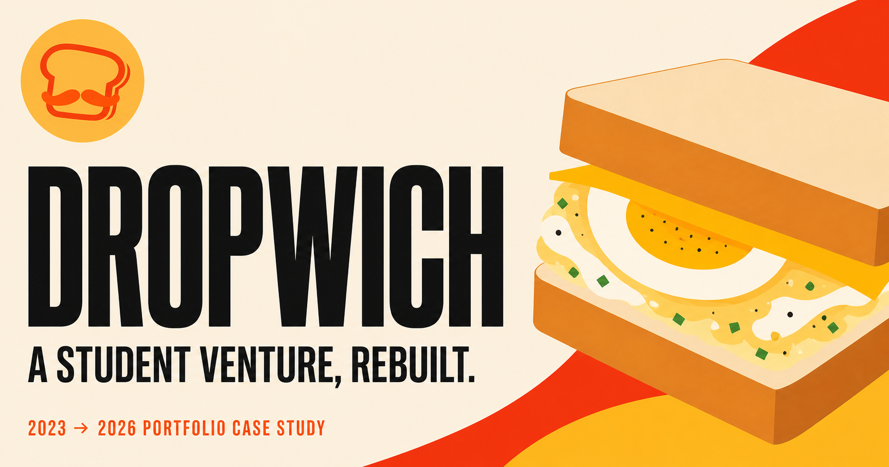

# Dropwich



A full-stack portfolio reconstruction of **Dropwich**, a student-run egg sandwich venture created during senior high school in 2023. The project turns the team’s original product-costing records, menu, organizational structure, and sales story into a modern ordering and operations experience.

## Highlights

- Responsive editorial storefront with an animated product gallery
- Interactive sandwich customization and visual sauce selection
- Shopping cart and persistent order workflow
- Customer registration and secure sign-in
- Role-protected operations and finance dashboard
- One-time administrator setup
- Company story and accessible team hierarchy
- D1/Drizzle data model for users, sessions, and orders

## Tech stack

- React 19 and TypeScript
- Next.js-compatible Vinext runtime
- Cloudflare Workers and D1
- Drizzle ORM
- Vite and Vitest-compatible Node tests
- CSS animations with reduced-motion support

## Run locally

Requires Node.js 22.13 or newer.

```bash
npm install
npm run dev
```

Open `http://localhost:3000`. To explore the protected dashboard locally, visit `/admin/setup` and create the first administrator account. Do not use a real password in a portfolio development environment.

## Quality checks

```bash
npm run lint
npm test
```

`npm test` creates a production build and then checks the public routes, ordering flow, protected dashboard boundary, responsive image hints, motion behavior, and accessibility contracts.

## Application tour

| Route | Purpose |
| --- | --- |
| `/` | Brand-led storefront, menu preview, featured product, and moving Dropwich gallery |
| `/menu` | Searchable product catalog |
| `/menu/[product]` | Sauce selection, quantity controls, notes, and order tray |
| `/story/brand` | Brand identity and original team hierarchy |
| `/story/why` | School context and the reason behind Dropwich |
| `/story/notice` | Portfolio reconstruction notice and project boundaries |
| `/story/history` | Animated timeline of the 2023 venture and modern rebuild |
| `/account` | Customer registration and sign-in |
| `/dashboard` | Role-protected operations and finance workspace |

## Architecture

- Route-focused React components live in `app/`.
- Shared navigation, footer, product visuals, and motion components live in `app/components/`.
- Product and sauce definitions are centralized in `app/data.ts`.
- Authentication and order endpoints live in `app/api/`.
- Database tables and migration-ready schema live in `db/`.
- Source-level contract tests live in `tests/` and protect important routes and interactions from accidental regressions.

## Portfolio value

This project demonstrates more than a landing page: it connects visual design, responsive product browsing, account flows, order persistence, authorization, business metrics, accessibility, and automated verification in one coherent case study.

## Project context

Dropwich was a real school entrepreneurship project. This repository is a later portfolio reconstruction, not an active restaurant or ordering service. The interface, implementation, generated product imagery, and presentation were created specifically for this portfolio project. It is not affiliated with EGGDROP or any similarly named commercial brand.

## Author

**Misha Andrei Recente** — original Dropwich Finance Officer and developer of this reconstruction.

## License

Source code is available under the [MIT License](LICENSE). Brand materials and original Dropwich business records remain the property of their respective student creators.
